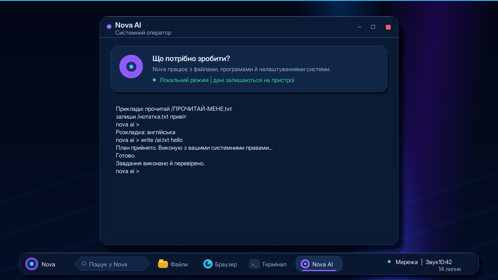
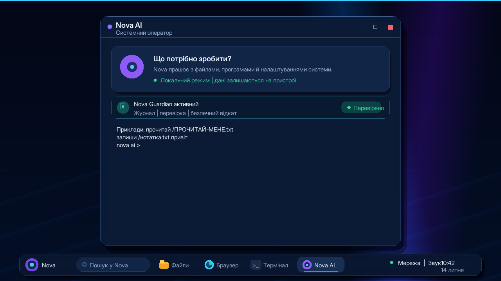
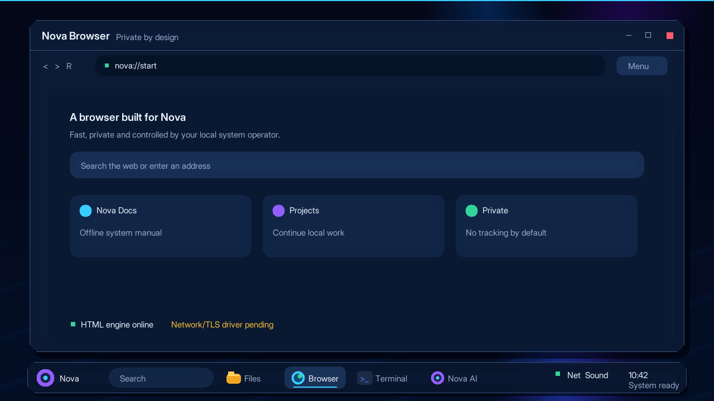

# Nova OS

Nova OS is a new x86-64 operating-system project whose kernel, system services,
tools, and applications are written in Rust. Its defining interface is a
privileged AI system operator: the operator receives user intent and can use the
same capabilities as the interactive user (files, processes, UI, network, and
development tools).

This repository is **not** a Linux distribution and does not wrap Windows. The
current milestone boots its own `no_std` kernel through BIOS or UEFI and opens
Nova Desktop: an adaptive framebuffer shell with a PS/2 mouse cursor, clickable
Ukrainian Домівка/Файли/Термінал/Nova AI/Браузер/Редактор/Програми,
keyboard shortcuts, a small RAM filesystem,
and a deterministic operator/tool router. A neural model is not included yet.







The current implementation follows the approved high-fidelity design reference:
[`nova-desktop-concept.png`](docs/nova-desktop-concept.png).

## Build and run

Requirements: Rustup with nightly Rust, `llvm-tools`, and QEMU x86-64.

```powershell
cargo build
cargo test -p agent-core
cargo run -- uefi
```

Disk images are copied to `dist/nova-os-uefi.img` and
`dist/nova-os-bios.img`. The UEFI image is the primary target.

## Nova VM Lab

`Nova VM Lab` is the native Rust desktop emulator front-end included with this
workspace. Launch `dist/Nova-VM-Lab.exe`, then either:

- press **Nova OS profile** to boot the current Nova image for debugging; or
- select an ISO, create a QCOW2 system disk, and press **Start / install**.

The lab supports BIOS and UEFI, configurable RAM/CPU, NAT networking, disposable
snapshot mode, and live serial/QEMU logs. Profiles and mutable disks are kept in
`%LOCALAPPDATA%/NovaVmLab` to avoid Windows/QEMU path problems. See
[`vm-lab/README.md`](vm-lab/README.md) for the installation workflow.

Inside the OS, try:

```text
status
ls
cat /README.txt
write /hello.txt hello from Nova
append /hello.txt !
ai read /hello.txt
run about
```

Desktop controls: use the mouse, or press `F1` for Home, `F2` for Files, `F3`
for Terminal, `F4` for Nova AI, `F5` for Control Center, `F6` for Nova Browser,
`F7` for the native Nova Editor, `F8` for Programs, and `Esc` to return Home.

The keyboard driver currently uses a US QWERTY map. RAM files are intentionally
not persistent in this desktop milestone.

## Non-negotiable design rules

- Rust source only for Nova-owned production components.
- AI runs in user space, never inside the kernel fault domain.

The strict final-release evidence matrix is maintained in
[`docs/ACCEPTANCE.md`](docs/ACCEPTANCE.md). Passing core-module tests is not
treated as proof that a hardware path is already integrated.

- The operator may receive a full-system capability, but actions are journaled;
  recovery remains possible after a bad model decision.
- Native drivers and services are asynchronous message-driven components.
- Applications target a Nova ABI first; a WebAssembly component runtime is a
  portability/sandbox option, not a Linux compatibility layer.

See [docs/RESEARCH.md](docs/RESEARCH.md), [docs/ARCHITECTURE.md](docs/ARCHITECTURE.md),
[docs/SELF_HOSTING.md](docs/SELF_HOSTING.md), [docs/BROWSER.md](docs/BROWSER.md), and
[docs/ROADMAP.md](docs/ROADMAP.md).
